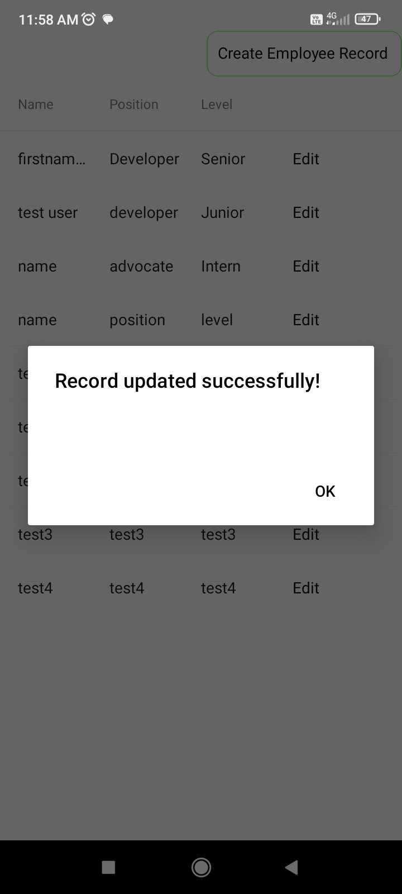

## Android Package(apk)
<a href="https://drive.google.com/file/d/13dff21X4HRlwnVfg-e5H9Z7h3Yg9sgru/view?usp=sharing">Employees Android Build Package(apk)</a>

## Screenshots

    
    
    
    
    
    
    
    

